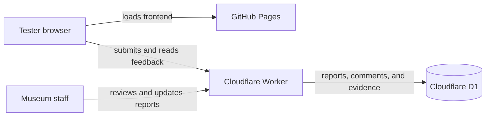

<div align="center">
  

  # Toy Soldier Brigade

  **Museum Donor Board Control Center**

  Manage donor records, design recognition boards, schedule display content,
  compose announcements and broadcasts, and review feedback from one workspace.

  [**Open the live Control Center →**](https://ijustcreate.github.io/toysoldierbrigade/)
  &nbsp;&nbsp;·&nbsp;&nbsp;
  [How to test](#testing-the-prototype)
  &nbsp;&nbsp;·&nbsp;&nbsp;
  [Developer setup](#developer-setup)

  
  
  
  
</div>


## What this project is

Project Lantern is an active prototype for the Children’s Museum of Stockton.
It is designed to become a durable, staff-friendly control center for portrait
and landscape donor-recognition displays.

The hosted site is for interface testing, workflow review, and feedback. The
planned museum installation uses the same React interface inside a Tauri
desktop application that can open dedicated display windows and persist
operational data on the museum computer.

> [!IMPORTANT]
> Use fictional or non-sensitive donor information in the public prototype.
> Do not enter passwords, payment information, private donor records, or other
> confidential museum data.

## Current workspaces

| Workspace | What it does |
| --- | --- |
| **Dashboard** | Monitors portrait and landscape displays, opens display windows, previews assigned boards, manages display schedules, and configures room cameras. |
| **Donors** | Creates and organizes donor profiles with tiers, categories, tags, stories, icons, ordering, status, and board assignments. |
| **Board Editor** | Builds reusable board programs with donor rosters, direct text editing, typography, color, background media, logos, layout, cameras, and 2D/3D presentation. |
| **Schedule** | Plans boards, announcements, and broadcasts in week, month, and agenda views with display targeting and recurrence. Conflicts are reported only for overlapping items of the same type. |
| **Announcements** | Creates saved message overlays with targeting, timing, layouts, colors, sounds, enhancements, scheduling, and a live display preview. |
| **Broadcast / Stream** | Composes camera, screen-share, or test feeds with movable text, direct frame manipulation, pan/zoom crop, masks, panel and canvas styling, background removal, effects, and recording. |
| **Settings** | Selects Dark, Light, Ocean, Warm, High contrast, or Sparkle Unicorn portal themes and maintains donor tiers, categories, and tags. |
| **Revisions** | Shows code changes and board publishes with affected areas, verification notes, and restore context. |
| **Bugs** | Captures, groups, filters, comments on, and tracks actionable feedback with annotated evidence and automatic diagnostic context. |

The **How to use** button on the Dashboard opens an in-app presentation and
quick-start guide with current screenshots of every workspace.

## A practical operating workflow

1. Open **Dashboard** and confirm that the expected displays are attached.
2. Add or update donor profiles in **Donors**.
3. Build the portrait and landscape experiences in **Board Editor**.
4. Assign boards to displays or place them on the **Schedule**.
5. Prepare saved **Announcements** for temporary message overlays.
6. Configure **Broadcast / Stream** when a camera or screen presentation is
   needed.
7. Preview the result on the intended display and check readability from the
   real viewing distance.
8. Publish only when the working content is ready to become live.
9. Use **Revisions** to understand recent changes or restore published boards.
10. Use the floating bug button when a workflow is confusing or broken.

### Understanding scheduled layers

Boards, announcements, and broadcasts are independent presentation layers:

- a board can run with an announcement;
- a board can run with a broadcast;
- an announcement can run with a broadcast; and
- conflicts occur only when two or more items of the **same type** overlap on
  the same display.

## Testing the prototype

The fastest useful test takes about ten minutes:

1. Open the [live Control Center](https://ijustcreate.github.io/toysoldierbrigade/)
   in current Chrome or Edge.
2. Choose **How to use** from the Dashboard for the visual walkthrough.
3. Explore the workspaces using fictional sample content.
4. Open a portrait or landscape display and compare it with its editor preview.
5. Try a theme in **Settings** and confirm the interface remains readable.
6. If something is unclear or broken, choose the floating bug button.
7. Explain what you were doing, what happened, and what you expected.
8. Add a capture or file when it helps, then save the report.

A useful report includes:

- short summary;
- exact reproduction steps;
- expected and actual results;
- frequency and severity;
- affected workspace, board, or display;
- browser and viewport details;
- screenshot, GIF, video, or log evidence when appropriate; and
- any workaround already tried.

The report form automatically adds app state, version, route, theme, platform,
recent client errors, and application logs so the result can be handed to
Codex with less manual reconstruction.

## Screenshots

| Donor management | Board design |
| --- | --- |
|  |  |

| Scheduling | Announcements |
| --- | --- |
|  |  |

| Broadcast studio | Settings |
| --- | --- |
|  |  |

| Revision history | Bug catalogue |
| --- | --- |
|  |  |

## Hosting and data flow

The public frontend remains static on GitHub Pages. Features requiring shared
writes use Cloudflare:



- **GitHub Pages** deploys the React/Vite frontend from `main`.
- **Cloudflare Worker** provides the shared feedback API.
- **Cloudflare D1** stores report text, workflow state, comments, diagnostics,
  and prototype-sized evidence.
- **Tauri** is the native Windows host for dedicated display windows and local
  museum operation.

Browser-local board and donor state is separate from the shared bug catalogue.
The production museum build is intended to keep operational recognition data on
the designated museum computer.

## Developer setup

### Requirements

- Node.js 22
- npm
- Current Chromium-based browser
- Rust and Windows build tools only for the native Tauri shell

### Run the web application

```powershell
npm install
npm run dev
```

Open the local URL printed by Vite.

### Verify production builds

```powershell
npm run build
npm run build:worker
```

### Run the native shell

```powershell
npm run tauri:dev
```

### Cloudflare feedback service

Configuration and implementation:

- [`wrangler.jsonc`](wrangler.jsonc)
- [`worker/bugs.ts`](worker/bugs.ts)
- [`worker/schema.sql`](worker/schema.sql)

After Wrangler authentication and D1 setup:

```powershell
npm run cloudflare:migrate
npm run cloudflare:deploy
```

Set the GitHub Actions repository variable `LANTERN_BUG_ENDPOINT` to the
deployed Worker endpoint. The Pages workflow exposes it to the frontend as
`VITE_LANTERN_BUG_ENDPOINT` and `VITE_LANTERN_SERVICE_ENDPOINT`.

### Pull live data into a local build

Local development intentionally never writes to the shared museum data. To let
the local app pull the current live site copy, create `.env.local` with the
read-only endpoint:

```text
VITE_LANTERN_READ_ENDPOINT=https://your-worker.example.workers.dev
```

Then use **Settings → Pull latest site changes** before making local edits. The
pull replaces the local working copy only after confirmation and does not write
anything back to the shared site.

## Repository map

```text
project-lantern/
├── .github/workflows/      GitHub Pages deployment
├── public/assets/help/     Current walkthrough and README screenshots
├── scripts/                Changelog and bug-work tooling
├── src/                    React control center and display renderer
├── src-tauri/              Native Windows/Tauri host
├── worker/                 Cloudflare feedback API and D1 schema
├── vite.config.ts          Web build and local feedback bridge
└── wrangler.jsonc          Cloudflare bindings and deployment settings
```

## Project workflow

After each material code or configuration change:

1. verify the change in proportion to its risk;
2. add one changelog entry per cohesive user-facing change; and
3. record bug-specific investigation and progress in the bug-work log.

Useful commands:

```powershell
npm run bugs -- list
npm run bugs -- show BUG-00002
npm run changelog -- --help
```

---

<div align="center">
  <strong>Project Lantern · Museum Donor Board Control Center</strong><br />
  A practical foundation for a durable museum recognition experience.
</div>
